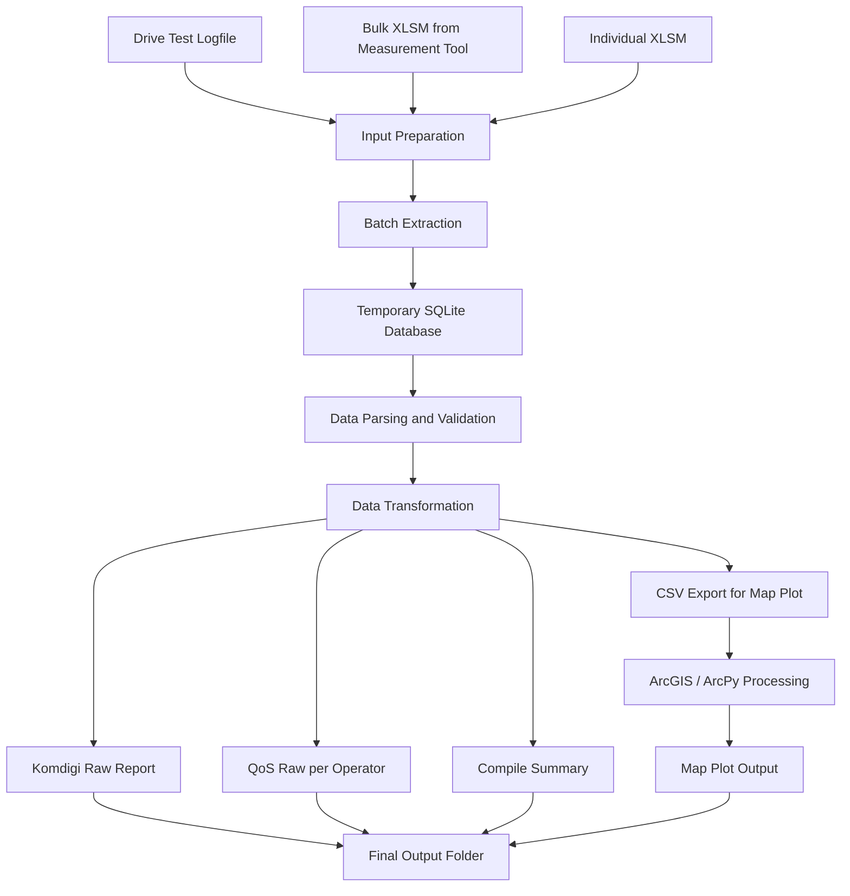

# N.Project - Drive Test Data Processing Automation

N.Project is a Python-based automation project built from scratch to process Drive Test measurement data accurately and efficiently.

This project was designed to handle multiple input sources, including:

1. Direct Drive Test logfile
2. Bulk `.xlsm` files processed from supporting measurement software
3. Specific generated bulk `.xlsm` files from supporting measurement software

From these input sources, N.Project generates reports based on the required workflow and reporting format.

N.Project is not a standalone reporting tool only. It is also integrated with ArcGIS as a generative Map Plot application to produce visual map-based outputs from processed measurement data.

The output generated by N.Project includes:

1. Compile Summary for each measurement parameter
2. Raw data reports grouped by each cellular operator
3. Map Plot images for geospatial visualization

> **Note**
> This repository is a portfolio case study. Full source code, internal templates, and production folder hierarchy are not publicly shared due to confidentiality.

---

## Main Problem

Manual processing of Drive Test measurement results requires repetitive steps such as file extraction, data validation, raw data transformation, report generation, and map plotting.

This process can take a long time and is prone to human error, especially when handling many collections, multiple operators, and large measurement datasets.

---

## Solution

N.Project automates the Drive Test data processing workflow by allowing users to prepare logfile or bulk files from supporting measurement applications, then process them into structured reports and map plot outputs automatically.

The automation reduces repetitive manual work and helps improve consistency, processing speed, and report accuracy.

---

## Key Features

* Batch extraction from measurement files
* SQLite-based temporary database processing
* Automated Komdigi Raw report generation
* QoS Raw report generation per cellular operator
* Compile Summary generation
* CSV export for map plotting
* Simple UI with process log monitoring
* Temporary file cleanup after processing
* ArcGIS / ArcPy integration for map plot generation

---

## Tech Stack

* Python
* SQLite
* Pandas
* OpenPyXL
* Win32 COM Excel Automation
* ArcGIS / ArcPy Integration
* Tkinter GUI

---

## Workflow




---

## System Overview

```text
Input Files
   │
   ├── Drive Test Logfile
   ├── Bulk XLSM
   └── Generated Bulk XLSM
        │
        ▼
N.Project Processing Pipeline
        │
        ├── File Extraction
        ├── SQLite Temporary Database
        ├── Data Validation
        ├── Report Generation
        ├── CSV Export
        └── Map Plot Integration
        │
        ▼
Final Outputs
   ├── Compile Summary
   ├── QoS Raw Reports
   ├── Komdigi Raw Reports
   └── Map Plot Images
```

---

## Screenshots

### UI Dashboard


---

### Processing Log


---

### Output Folder


---

### Generated Excel Report


---

### Map Plot Output


---

## Code Preview

This repository only contains simplified code previews to demonstrate the project structure and processing concept.

Production source code, internal templates, sensitive business rules, and real measurement data are not included.

Example simplified pipeline concept:

```python
class DriveTestPipeline:
    def run(self, target_folder):
        self.prepare_workspace(target_folder)
        self.extract_measurement_files()
        self.build_temporary_database()
        self.validate_and_transform_data()
        self.generate_excel_reports()
        self.export_mapplot_csv()
        self.cleanup_temporary_files()
```

---

## Repository Scope

Included in this portfolio repository:

* Project overview
* Workflow documentation
* System architecture explanation
* UI and output screenshots
* Simplified code preview
* Dummy or anonymized sample outputs

Not included:

* Full production source code
* Internal Excel templates
* Real Drive Test data
* Confidential business logic
* Production folder hierarchy
* Internal automation configuration

---

## Privacy Notice

All screenshots and samples use dummy or anonymized data.

Internal templates, real Drive Test datasets, confidential workflow details, and full source code are not included in this public repository.
